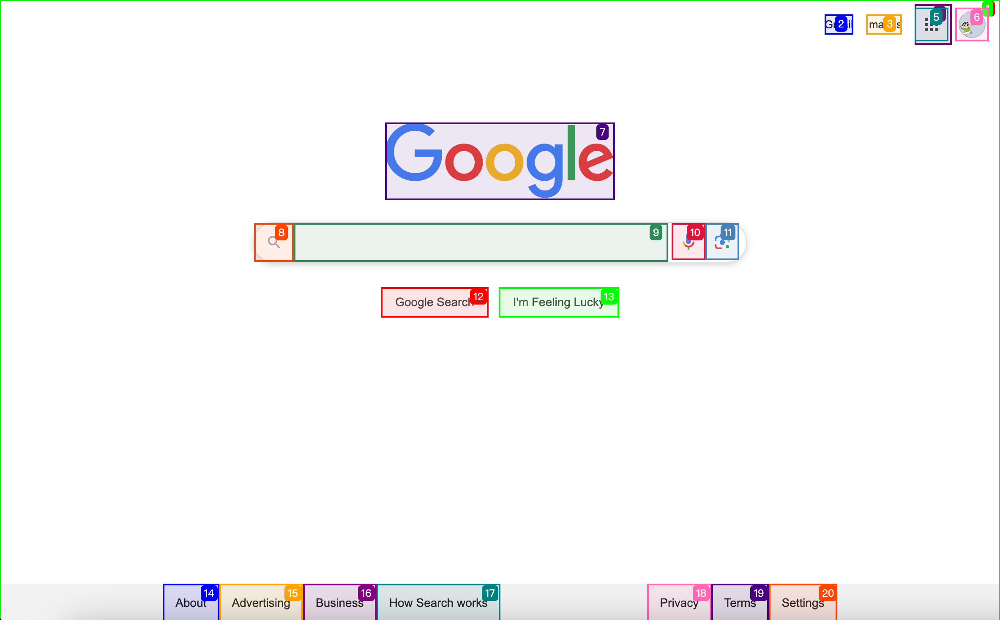

## What is Web Extraction Technology?

Web Extraction Technology is an innovative browser automation solution, Use in eko browser use. It combines visual recognition with contextual information about elements to enhance accuracy and efficiency in automated tasks within complex web environments. By extracting interactive elements and relevant data from web pages, Web Extraction Technology significantly improves the success rate of automation tasks.

## Why Do We Need Web Extraction Technology?

In today's digital world, web page designs are increasingly complex, presenting several challenges for traditional browser automation methods:

1. **Complex Element Structures**: Traditional visual models directly manipulating the browser can suffer from inaccuracies due to variations in devices, resolutions, and browsers, leading to potential misoperations.

2. **Massive HTML Content**: Handling the entire HTML content of a webpage can be time-consuming and error-prone, especially when content extends to hundreds of thousands of characters.

Given these limitations, traditional methods often lack the reliability needed in complex scenarios, necessitating a more robust approach to bolster automation effectiveness.

## How Does Web Extraction Technology Work?

1. **Identify Interactive Elements**: Extract all interactive elements on a page, like buttons, input fields, and links.

2. **Tag Elements**: Mark each actionable element on the webpage with unique IDs using colored boxes.

3. **Combine Screenshots and Pseudo-HTML**: Construct pseudo-HTML that includes these element details, paired with screenshots, to be processed by automation models.

### Technical Principles

Mark executable elements in the webpage, such as clickable, input-enabled elements and those with event listeners, and assign element IDs to each executable element




Extract text labels and executable element tagNames and attributes, build pseudo HTML for model recognition using text + visual approach

```html
[0]:<body></body>
[1]:<div></div>
[2]:<a aria-label="Gmail ">Gmail</a>
[3]:<a aria-label="Search for Images ">Images</a>
[4]:<div id="gbwa"></div>
[5]:<a role="button" tabindex="0" aria-label="Google apps" aria-expanded="false"></a>
[6]:<a role="button" tabindex="0" aria-label="Google Account: Luozhuowei   (zhuowei@fellou.ai)" aria-expanded="false"></a>
[7]:</img>
[8]:<div></div>
[9]:<textarea id="APjFqb" title="Search" name="q" role="combobox" aria-label="Search" aria-expanded="false"></textarea>
[10]:<div role="button" tabindex="0" aria-label="Search by voice"></div>
[11]:<div role="button" tabindex="0" aria-label="Search by image"></div>
[12]:<input type="submit" name="btnK" role="button" tabindex="0" aria-label="Google Search" value="Google Search"></input>
[13]:<input type="submit" name="btnI" aria-label="I'm Feeling Lucky" value="I'm Feeling Lucky"></input>
[14]:<a>About</a>
[15]:<a>Advertising</a>
[16]:<a>Business</a>
[17]:<a>How Search works</a>
[18]:<a>Privacy</a>
[19]:<a>Terms</a>
[20]:<div role="button" tabindex="0" aria-expanded="false">Settings</div>
```

Utilizing pseudo-HTML and screenshot information allows models to clearly understand page structure and interaction points.

## Advantages of Web Extraction Technology

1. **Improved Accuracy**: Reduces misoperations and errors in element recognition through bounding and ID management.

2. **Performance Optimization**: Pseudo-HTML significantly decreases the data volume compared to processing massive HTML directly, enhancing efficiency.

3. **Enhanced Adaptability**: Maintains consistency across different devices and browser environments.

4. **Strong Capability for Complex Pages**: Suitable for automation needs in complex structured web pages by integrating visual recognition and text understanding.
