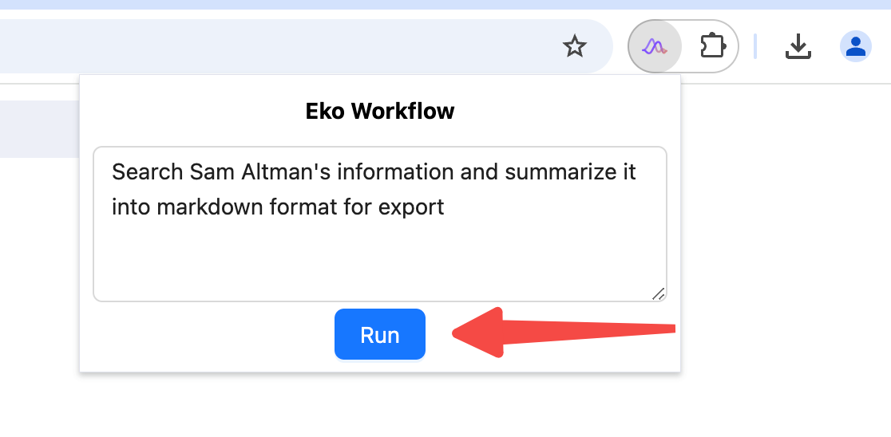
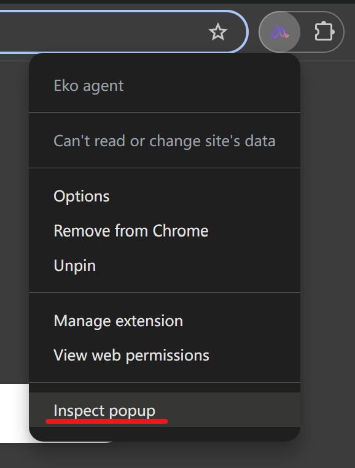

Let's create an Eko workflow together in a browser extension to automate the task that `Search Sam Altman's information and summarize it into markdown format for export`. 

> With this plugin, you no longer need to manually open multiple web pages; instead, you can run everything with a single click.

<video controls>
  <source src="/docs/quickstart.mov" />
</video>

## Load extension

- Download latest stable version of [FellouAI/eko-browser-extension-template](https://github.com/FellouAI/eko-browser-extension-template/releases). Unzip the ZIP file to a suitable location, and you should see a `dist` folder.
- Open the [Chrome browser](https://www.google.com/chrome/) and navigate to `chrome://extensions/`.
- Turn on `Developer mode` (toggle switch in the top right corner).
- Click `Load unpacked` button (the blue text in the top-left corner) and select the `dist` folder in the first step.
- For **Chinese** users: If it's inconvenient to obtain an API key from the OpenAI or Claude platform, consider using mirror sites or services (such as [ZetaTechs API](https://api.zetatechs.com/)), and then replace the *Base URL* and *API key* with the corresponding values.

<video controls>
  <source src="/docs/load_extension.mov" />
</video>

## Configure LLM model API Key

- Click the `Details` button on the `eko agent` card.
- Scroll down to find the `Extension options` section.
- Open it and enter your LLM model API Key.

<video controls>
  <source src="/docs/config_llm.mov" />
</video>

## Let's run it!
Pin the current extension in the browser's top-right extensions menu, click the extension to open the popup, input task prompt, and click the RUN button to execute.

Run your workflow by clicking the RUN button in the extension popup.
<video controls>
  <source src="/docs/quickstart.mov" />
</video>

If you want to view more logs, you can right-click on the Eko icon and select "Inspect popup", which will open the Chrome DevTools window. Once opened, please ensure that this window is not in focus to avoid any issues with some tools not functioning properly.



## As a Framework...

As a framework, Eko provide some callbacks that allow developers DIY the implementions. There's an example:

```typescript
...
export async function main(prompt: string) {
  let chromeProxy = createChromeApiProxy(MyChromeProxy);
  let config = await getLLMConfig(chromeProxy);
  if (!config || !config.apiKey) {
    printLog("Please configure apiKey", "error");
    return;
  }

  let eko = new Eko(config as LLMConfig, { callback: hookLogs(), chromeProxy: chromeProxy });

  const workflow = await eko.generate(prompt);

  await eko.execute(workflow);
}

function hookLogs(): WorkflowCallback {
  return {
    hooks: {
      beforeWorkflow: async (workflow) => {
        printLog("Start workflow: " + workflow.name);
      },
      beforeSubtask: async (subtask, context) => {
        printLog("> subtask: " + subtask.name);
      },
      beforeToolUse: async (tool, context, input) => {
        printLog("> tool: " + tool.name);
        return input;
      },
      afterToolUse: async (tool, context, result) => {
        printLog("  tool: " + tool.name + " completed", "success");
        return result;
      },
      afterSubtask: async (subtask, context, result) => {
        printLog("  subtask: " + subtask.name + " completed", "success");
      },
      afterWorkflow: async (workflow, variables) => {
        printLog("Completed", "success");
      },
      onLlmMessage: async (textContent) => {
        printLog("LLM: " + textContent);
      },
    },
  };
}
```

For more details, see [Build from source](/docs/getting-started/build-from-source) and [Dive deep into Eko](/docs/getting-started/dive-deep).

## Next Steps

Now that you have run the first workflow, you can:

- Understand the [Installation](/docs/getting-started/installation) of Eko in different environments
- Learn about Eko's [Configuration](/docs/getting-started/configuration) in different environments
- Learn more core concepts of Eko: [Dive deep into Eko](/docs/getting-started/dive-deep)
- Build the browser extension from source: [Build from source](/docs/getting-started/build-from-source)
- Join our [Discard](https://discord.gg/XpFfk2e5): 

