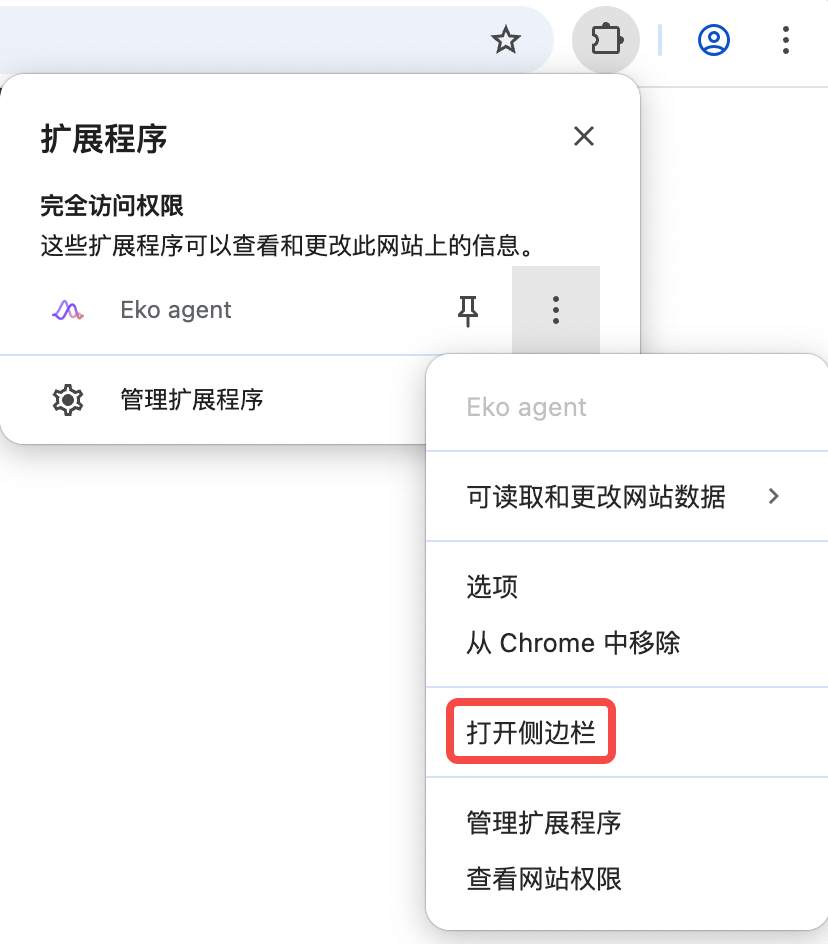
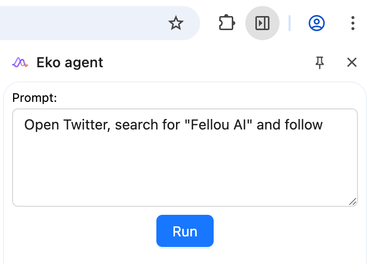

Here are two quick ways to get started:
1. **Using a browser extension**: Suitable for those who just want to try it out or are not professionals.
2. **Writing and running a Node.js script**: Suitable for professionals who want to review or modify the code details.

## Using a browser extension

Let's run an Eko workflow together in a browser extension to automate the task that `Open Twitter, search for "Fellou AI" and follow`. 

### Load extension

- Download the [precompiled extension](../../../../public/dist.zip). Unzip the ZIP file to a suitable location, and you should see a `dist` folder.
- Open the [Chrome browser](https://www.google.com/chrome/) and navigate to `chrome://extensions/`.
- Turn on `Developer mode` (toggle switch in the top right corner).
- Click `Load unpacked` button (the blue text in the top-left corner) and select the `dist` folder in the first step.
- For **Chinese** users: If it's inconvenient to obtain an API key from the OpenAI or Claude platform, consider using mirror sites or services (such as [ZetaTechs API](https://api.zetatechs.com/)), and then replace the *Base URL* and *API key* with the corresponding values.

### Configure LLM model API Key

- Click the `Details` button on the `eko agent` card.
- Scroll down to find the `Extension options` section.
- Open it and enter your LLM model API Key.

### Let's run it!
Open the side-bar of the extension:


input your prompt, and click the Run button.


## Writing and running a Node.js script

First we need to clone the Eko repository:
```
git clone git@github.com:FellouAI/eko.git
```

Checkout to the `develop` branch:
```
git checkout develop
```

And `cd` to the `example/nodejs` floder:
```
cd eko/example/nodejs
```

Remember to set the environment variables (one of OpenAI/Claude):
```
export OPENAI_BASE_URL=your_value
export OPENAI_API_KEY=your_value
export ANTHROPIC_BASE_URL=your_value
export ANTHROPIC_API_KEY=your_value
```

Finally install dependencies and run:
```
npm install
npm run dev
```

## Next Steps

Now that you have run the first workflow, you can:

- Understand the [Installation](/docs/getting-started/installation) of Eko in different environments
- Learn about Eko's [Configuration](/docs/getting-started/configuration) in different environments
- Learn more core concepts of Eko: [Dive deep into Eko](/docs/getting-started/dive-deep)
- Build the browser extension from source: [Build from source](/docs/getting-started/build-from-source)
- Join our [Discard](https://discord.gg/XpFfk2e5): 

