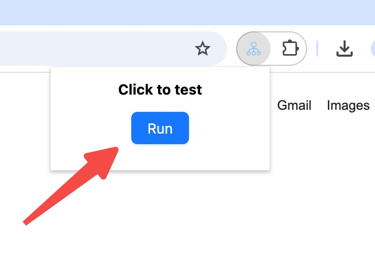

Let's create an eko workflow together in a browser extension to automate the task that `Search Sam Altman's information and summarize it into markdown format for export`. 

> With this plugin, you no longer need to manually open multiple web pages; instead, you can run everything with a single click.

<video controls>
  <source src="/docs/run_workflow.mov" />
</video>

## Prerequisites
1. **Install `npm`**: Make sure you have [Node.js](https://nodejs.org/) installed. You will also need either `npm` or `pnpm` for managing dependencies. If you haven't installed `pnpm` yet, follow these steps:

2. **Install `pnpm`**
   ```bash
   npm install -g pnpm
   ```
> Note: If you prefer using `npm` for the setup, you can skip the pnpm installation and use npm commands instead. However, pnpm is faster and more efficient with handling dependencies.

## Install Eko
Let's start by creating a new project and installing Eko:

```bash
# Install the Eko CLI globally
pnpm install @eko-ai/eko-cli -g

# Create a new browser extension project
eko-cli init browser-extension-demo

# Install dependencies
cd browser-extension-demo
pnpm install
```

> If npm environment variables are not configured on Windows, the `eko-cli` command may show as non-existent. Alternatively, you can directly clone our provided template project.
`git clone https://github.com/FellouAI/eko-browser-extension-template.git`

## Creat your first workflow

By default, you do NOT need to manually create a workflow yourself, as it has already been created in the `src/background/first_workflow.ts` file in the previous steps. Since the documentation may not always be up-to-date, please revert to the previous code if you encounter any issues in the subsequent steps.

Write your workflow in the `src/background/first_workflow.ts` file:
```bash
vim src/background/first_workflow.ts
```
Paste the following content. Press `:wq` to exit.
```typescript
// src/background/first_workflow.ts
import { Eko } from "@eko-ai/eko";
import { EkoConfig, WorkflowCallback } from "@eko-ai/eko/types";
import { getLLMConfig } from "@eko-ai/eko/extension";

export async function run_workflow(prompt: string) {
  // Load LLM model configuration
  // the current browser plugin project provides a page for configuring LLM parameters
  let config = await getLLMConfig();
  if (!config || !config.apiKey) {
    printLog("Please configure apiKey", "error");
    return;
  }

  // Initialize eko
  let eko = new Eko(config as EkoConfig);

  // Generate a workflow from natural language description
  const workflow = await eko.generate(prompt);

  // Execute the workflow
  await eko.execute(workflow, hookLogs());
}

function hookLogs(): WorkflowCallback {
  return {
    hooks: {
      beforeWorkflow: async (workflow) => {
        printLog("Start workflow: " + workflow.name);
      },
      beforeSubtask: async (subtask, context) => {
        printLog("> subtask: " + subtask.name);
      },
      beforeToolUse: async (tool, context, input) => {
        printLog("> tool: " + tool.name);
        return input;
      },
      afterToolUse: async (tool, context, result) => {
        printLog("  tool: " + tool.name + " completed", "success");
        return result;
      },
      afterSubtask: async (subtask, context, result) => {
        printLog("  subtask: " + subtask.name + " completed", "success");
      },
      afterWorkflow: async (workflow, variables) => {
        printLog("Completed", "success");
      },
    },
  };
}

function printLog(log: string, level?: "info" | "success" | "error") {
  chrome.runtime.sendMessage({ type: "log", log, level: level || "info" });
}
```

> Click [here](https://github.com/FellouAI/eko-demos/tree/main/browser-extension-quickstart) to view the sample demo code, or directly [download the extension](https://github.com/FellouAI/eko-demos/tree/main/browser-extension-quickstart/dist) to experience the workflow.

3. **Build**: Build the project into browser-loadable extension code:
```bash
pnpm run build:dev
```

## Load extension

- Open the [Chrome browser](https://www.google.com/chrome/) and navigate to `chrome://extensions/`.
- Turn on `Developer mode` (toggle switch in the top right corner).
- Click `Load unpacked` button (the blue text in the top-left corner) and select the `dist` folder of the project (_e.g._, `[root_directory]/Eko/browser-extension-demo/dist`).

<video controls>
  <source src="/docs/load_extension.mov" />
</video>

## Configure LLM model API Key

- Click the `Details` button on the `eko agent` card.
- Scroll down to find the `Extension options` section.
- Open it and enter your LLM model API Key.

<video controls>
  <source src="/docs/config_llm.mov" />
</video>

## Let's run it!
Pin the current extension in the browser's top-right extensions menu, click the extension to open the popup, and click the RUN button to execute.

Run your workflow by clicking the RUN button in the extension popup.
<video controls>
  <source src="/docs/run_workflow.mov" />
</video>

## Next Steps

Now that you have run the first workflow, you can:

- Understand the [Installation](/docs/getting-started/installation) of Eko in different environments
- Learn about Eko's [Configuration](/docs/getting-started/configuration) in different environments
- Learn more core concepts of eko: [Dive deep into Eko](/docs/getting-started/dive-deep)
